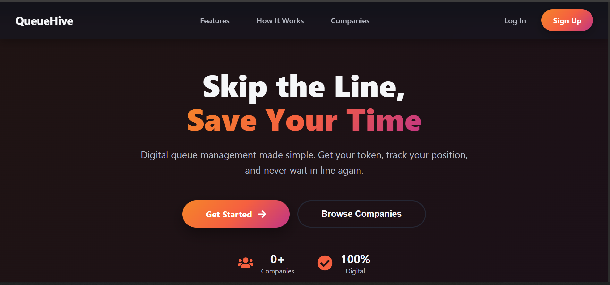

# QueueHive: Smart Queue Management System

<div align="center">

**Eliminate physical queues with intelligent digital token management**

[](https://hub.docker.com/r/manjoseph7/queuehive)
[](https://openjdk.org/)
[](https://spring.io/projects/spring-boot)
[](https://reactjs.org/)
[](https://www.postgresql.org/)

</div>

---

## 📖 Overview

QueueHive is a modern, full-stack application designed to eliminate physical queues by providing a seamless digital token generation system. Customers can view companies, select services, and receive a queue token, all from a clean, real-time web interface.



---

## ✨ Key Features

### 🏢 For Companies
- **Service Management**: Register and manage multiple service types
- **Queue Dashboard**: Real-time monitoring of active queues and tokens
- **Customer Analytics**: Track service usage and queue statistics
- **Approval Workflow**: Admin-controlled company registration

### 👥 For Users
- **Digital Tokens**: Instant token generation for selected services
- **Real-time Updates**: Live queue status via WebSocket connections
- **Token History**: View past and active tokens
- **Multi-company Support**: Browse and book services from different companies

### 🔐 For Administrators
- **User Management**: Comprehensive user administration panel
- **Company Approval**: Review and approve company registrations
- **System Monitoring**: Track platform usage and statistics
- **Role-based Access**: Secure authentication with JWT

### 💻 Technical Features
- **Real-time Communication**: WebSocket integration for live updates
- **Responsive Design**: Material Design 3 principles for modern UI
- **Secure Authentication**: JWT-based authentication and authorization
- **Containerized Deployment**: Full Docker Compose orchestration
- **RESTful API**: Well-structured backend API endpoints

---

## 🛠️ Technology Stack

| Layer | Technologies |
|-------|-------------|
| **Frontend** | React 18, React Router, Axios, STOMP.js, CSS Modules |
| **Backend** | Java 21, Spring Boot 3, Spring Data JPA, Spring Security, JWT |
| **Real-time** | WebSocket, STOMP Protocol |
| **Database** | PostgreSQL 15 |
| **DevOps** | Docker, Docker Compose, Maven, npm |
| **Build Tools** | Maven (Backend), npm (Frontend) |

---

## 🚀 Quick Start

### Prerequisites
- [Docker Desktop](https://www.docker.com/get-started) (recommended)
- Or: Java 21, Node.js 18+, PostgreSQL 15 (for manual setup)

### Using Docker Compose (Recommended)

```bash
# Clone the repository
git clone https://github.com/ManJoseph/QueueHive.git
cd QueueHive

# Start all services (PostgreSQL, Backend, pgAdmin)
docker-compose up -d

# Access the application
# Frontend & API: http://localhost:8080
# pgAdmin: http://localhost:5050
```

### Using Pre-built Docker Image

```bash
# Pull the latest image from Docker Hub
docker pull manjoseph7/queuehive:latest

# Run with Docker Compose (recommended)
# See README-DOCKER.md for detailed instructions
```

### Manual Setup

For manual installation without Docker, see **[Setup Instructions](./docs/Setup_Instructions.md)**.

---

## 📚 Documentation

- **[Docker Deployment Guide](./README-DOCKER.md)** - Comprehensive Docker setup and deployment
- **[Setup Instructions](./docs/Setup_Instructions.md)** - Manual installation guide
- **[API Documentation](./docs/API_Documentation.md)** - REST API endpoints reference
- **[UML Diagrams](./docs/UML_Diagrams.md)** - System architecture and design

---

## 📂 Project Structure

```
QueueHive/
├── QueueHive_BE/          # Spring Boot backend application
│   ├── src/main/java/     # Java source code
│   ├── src/main/resources/# Application properties and configs
│   └── pom.xml            # Maven dependencies
├── QueueHive_FE/          # React frontend application
│   └── queuehive/
│       ├── src/           # React components and pages
│       ├── public/        # Static assets
│       └── package.json   # npm dependencies
├── docs/                  # Documentation files
├── Dockerfile             # Multi-stage Docker build
├── docker-compose.yml     # Service orchestration
└── README.md              # This file
```

---

## 🎯 Use Cases

1. **Healthcare Clinics**: Manage patient queues for different departments
2. **Government Services**: Streamline citizen service requests
3. **Retail Stores**: Organize customer service queues
4. **Restaurants**: Digital waiting list management
5. **Service Centers**: Appointment and queue management

---

## 🔧 Development

### Running Locally

**Backend:**
```bash
cd QueueHive_BE
mvn spring-boot:run
```

**Frontend:**
```bash
cd QueueHive_FE/queuehive
npm install
npm start
```

### Building for Production

```bash
# Build Docker image
docker build -t queuehive:latest .

# Or use Docker Compose
docker-compose up --build
```

---

## 🌐 Deployment

### Docker Hub
Pre-built images are available on Docker Hub:
- **Repository**: [manjoseph7/queuehive](https://hub.docker.com/r/manjoseph7/queuehive)
- **Tags**: `latest`, version-specific tags

### Production Considerations
- Use environment variables for sensitive configuration
- Enable HTTPS with reverse proxy (Nginx/Traefik)
- Set up regular database backups
- Configure resource limits for containers
- Monitor application health and logs

See [README-DOCKER.md](./README-DOCKER.md) for detailed deployment instructions.

---

## 🤝 Contributing

Contributions are welcome! Please feel free to submit issues and pull requests.

### How to Contribute
1. Fork the repository
2. Create a feature branch (`git checkout -b feature/AmazingFeature`)
3. Commit your changes (`git commit -m 'Add some AmazingFeature'`)
4. Push to the branch (`git push origin feature/AmazingFeature`)
5. Open a Pull Request

---

## 📞 Support & Contact

- **GitHub Repository**: [ManJoseph/QueueHive](https://github.com/ManJoseph/QueueHive)
- **Issues & Bug Reports**: [GitHub Issues](https://github.com/ManJoseph/QueueHive/issues)
- **Docker Hub**: [manjoseph7/queuehive](https://hub.docker.com/r/manjoseph7/queuehive)

---

## 👨‍💻 Author

**Joseph MANIZABAYO**
- GitHub: [@ManJoseph](https://github.com/ManJoseph)

---

<div align="center">

⭐ Star this repository if you find it helpful!

</div>
