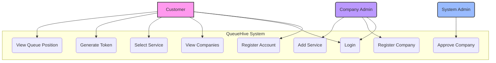
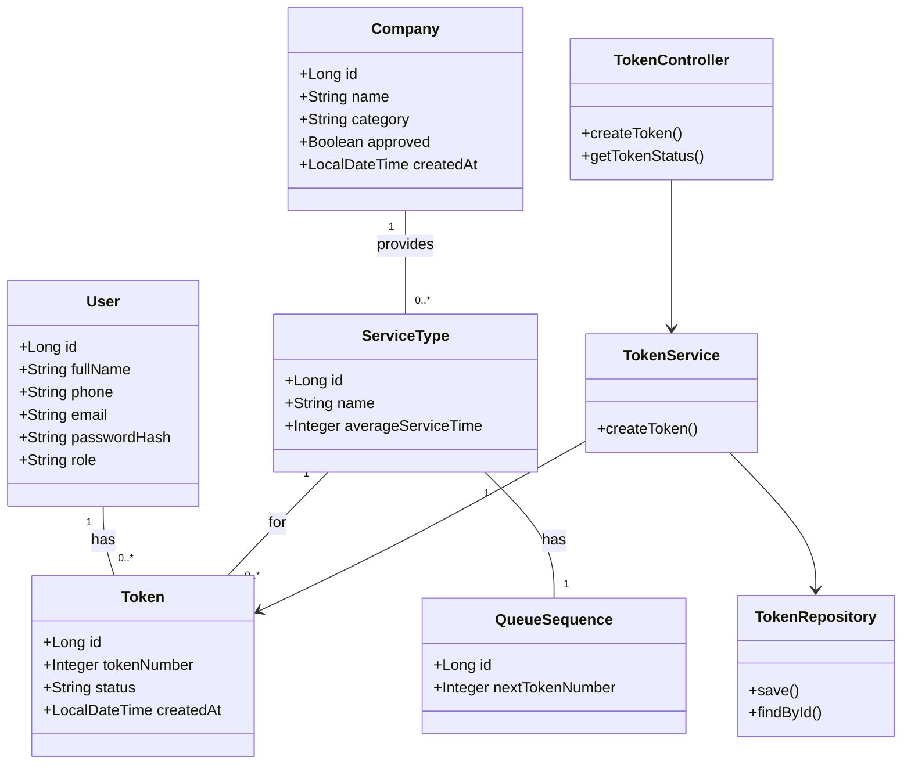

# UML Diagrams

This document contains Use Case, Class, and Activity diagrams to model the QueueHive system.

---

## 1. Use Case Diagram

This diagram shows the interactions between users (actors) and the main features of the system.



---

## 2. Class Diagram

This diagram represents the domain model and key components of the backend application.



---

## 3. Activity Diagram

This diagram illustrates the user flow for generating a new queue token.

```mermaid
activityDiagram
    title Token Generation Flow

    start
    :User opens the application;
    :User views list of companies;
    :User selects a company;
    :System displays services for the selected company;
    :User selects a service;
    
    if (User is logged in?) then (Yes)
        :System generates a new token;
        partition "Transactional" {
            :Find or create QueueSequence for the service;
            :Assign nextTokenNumber to token;
            :Increment nextTokenNumber in QueueSequence;
        }
        :System saves the new token;
        :System broadcasts update via WebSocket;
        :Display token number and queue position to user;
    else (No)
        :Redirect to Login/Register page;
        stop
    endif
    
    stop
```
